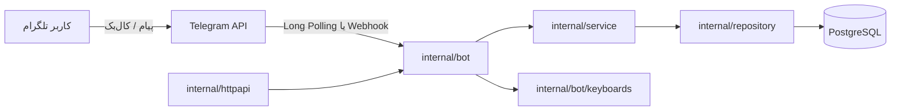
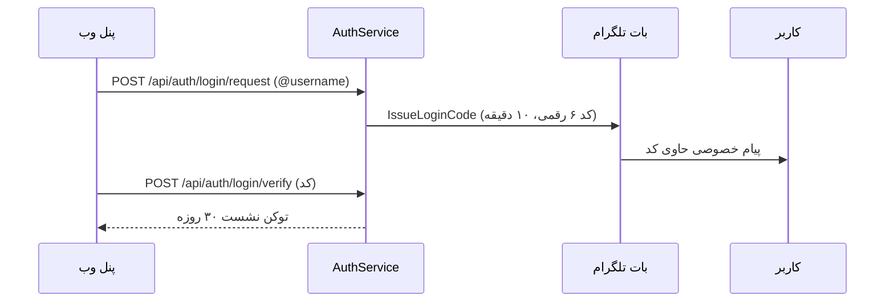

# 🏗 معماری پلنیکس

این سند توضیح می‌دهد پلنیکس چطور سازمان‌دهی شده، یک آپدیت تلگرام چه مسیری را طی می‌کند و چرا این تصمیم‌ها گرفته شده‌اند.

## نمای کلی

## لایه‌ها

| لایه | مسیر | مسئولیت |
|---|---|---|
| ورودی | `cmd/planix` | اجرا، خاموشی نرم، هندل سیگنال‌ها |
| چیدمان | `internal/app` | ساخت config، logger، db، bot و زمان‌بند |
| بات | `internal/bot` | تبدیل آپدیت تلگرام به اکشن؛ هیچ SQL ای اینجا نیست |
| سرویس | `internal/service` | قواعد کسب‌وکار (موعد پیش‌فرض، لاگ رویدادها) |
| مخزن | `internal/repository` | تمام کوئری‌های GORM |
| دامنه | `internal/domain` | فقط ساختارهای جدول‌ها |
| پلتفرم | `internal/platform` | اتصال PostgreSQL و لاگر zap |
| HTTP | `internal/httpapi` | `/healthz`، API پنل وب و وب‌هوک تلگرام |

قاعده‌ی وابستگی: `bot → service → repository → domain`. هیچ لایه‌ی بالادستی مستقیماً به GORM دسترسی ندارد.

## مسیر یک آپدیت

۱. `StartPolling` (یا وب‌هوک) آپدیت را دریافت می‌کند؛ حلقه‌ی polling در برابر پنیک محافظت می‌شود.
۲. `HandleUpdate` تشخیص می‌دهد آپدیت پیام است یا کال‌بک.
۳. پیام‌های متنی: اول کاربر upsert می‌شود، بعد دستورهای منو هندل می‌شوند؛ بقیه به `checkState` می‌روند.
۴. `checkState` بر اساس نشست فعال (`BotSession`) تصمیم می‌گیرد ورودی کاربر «عنوان تسک» است یا «واگذاری» یا «ویرایش».
۵. کال‌بک‌ها با پیشوند مسیریابی می‌شوند: `nav:` (منو)، `list:` (فهرست با فیلتر و صفحه)، `task:` (عملیات تسک)، `user:` (انتخاب کاربر)، `settings:` (تنظیمات) و `state:` (لغو). دیتای هر کال‌بک مبدأ نمایش (فهرست یا کارت) را هم حمل می‌کند تا همان پیام درجا رندر شود.
۶. هر تغییر مهم در جدول `ActivityLog` ثبت می‌شود.
۷. زمان‌بند cron دو کار دارد: گزارش روزانه (`DAILY_REPORT_CRON`) و یادآوری موعد (`REMINDER_CRON`؛ هر تسک فقط یک بار با فیلد `reminded_at` یادآوری می‌شود).

## ماشین وضعیت مکالمه

| وضعیت | معنی | داده‌ی نشست |
|---|---|---|
| `waiting_task_title` | انتظار عنوان تسک جدید یا ویرایش عنوان | `{}` یا `{"task_id": "..."}` |
| `waiting_task_description` | انتظار توضیحات جدید | `{"task_id": "..."}` |
| `waiting_task_for_other` | انتظار فرمت واگذاری | `{}` |
| `waiting_task_status_for_other` | انتظار یوزرنیم برای پیگیری | `{}` |
| `waiting_search` | انتظار عبارت جستجو | `{}` |

دیتای نشست برای جریان‌های ویرایش شامل شناسه‌ی تسک و مقصد بازگشت (`back`) است تا بعد از ذخیره، همان کارت درجا رندر شود.

هر نشست ۳۰ دقیقه اعتبار دارد و با دکمه‌ی «❌ لغو» پاک می‌شود.

## مدل داده

- **User** — شناسه‌ی داخلی UUID جدا از `TelegramID`؛ این جداسازی اضافه‌کردن وب‌اپ یا پیام‌رسان دیگر در آینده را بدون تغییر معماری ممکن می‌کند.
- **Task** — `OwnerID` (کسی که تسک را داده) و `AssigneeID` (مجری) از هم جدا هستند؛ واگذاری همان رابطه‌ی دوتایی است.
- **Planner / TaskEvidence** — برای برنامه‌های بلندمدت و پیوست مدرک؛ هنوز در UI بات فعال نشده‌اند.
- **ActivityLog** — ثبت رویدادها برای گزارش‌گیری بعدی.
- **BotSession** — وضعیت مکالمه‌ی چندمرحله‌ای با انقضا.

## ورود به پنل وب با OTP

نشست‌ها در جدول `web_sessions` نگهداری می‌شوند؛ با هر درخواست، `last_seen_at` بروز می‌شود و اگر تا کمتر از ۷ روز به انقضا مانده باشد، اعتبار ۳۰ روزه دوباره تمدید می‌شود (لغزان). کدهای ورود یک‌بارمصرف‌اند و صدور کد جدید، کدهای قبلی همان کاربر را باطل می‌کند.

## سیستم لاگ

- لاگر ریشه zap است: پروداکشن JSON با نمونه‌گیری، توسعه کنسول رنگی
- لاگر GORM داخل zap هدایت شده؛ کوئری‌های کند (>۵۰۰ms) و خطاها برجسته می‌شوند
- هر درخواست HTTP یک `X-Request-ID` می‌گیرد و همه‌ی لاگ‌های همان درخواست این شناسه را حمل می‌کنند
- رویدادهای مهم کسب‌وکار (ثبت/انجام تسک، ورود، تغییر پروفایل) در جدول `ActivityLog` ثبت می‌شوند

## زبان کاربر

هر کاربر یک فیلد `lang` دارد (پیش‌فرض `fa`) و از ⚙️ تنظیمات بین فارسی و انگلیسی سوییچ می‌کند. همه‌ی متن‌ها، کیبوردها، فرمت‌کننده‌ها و یادآوری‌ها در پکیج `bot/ui` بر اساس همین فیلد رندر می‌شوند؛ callback data مستقل از زبان است.

## تصمیم‌های مهم

- **لانگ‌پولینگ به‌عنوان پیش‌فرض** — بدون نیاز به دامنه و HTTPS کار می‌کند؛ وب‌هوک برای پروداکشن آماده است.
- **مهاجرت خودکار با AutoMigrate** — برای مقیاس فعلی کافی است؛ بعداً می‌توان به ابزار مهاجرت نسخه‌دار مهاجرت کرد.
- **دیتای نشست به‌صورت JSON** — انعطاف افزودن داده‌ی جدید بدون تغییر اسکیما.
- **کتابخانه‌ی go-telegram/bot** — دنبال‌کننده‌ی فعال Bot API (نسخه 10.3)؛ فیلد `style` دکمه‌های رنگی و مارکاپ‌های جدید را پشتیبانی می‌کند.
- **رندر درجا با EditMessageText** — به‌جای اسپم پیام، فهرست‌ها و کارت‌ها روی همان پیام بروزرسانی می‌شوند؛ مبدأ هر دکمه در callback_data سفر می‌کند.
